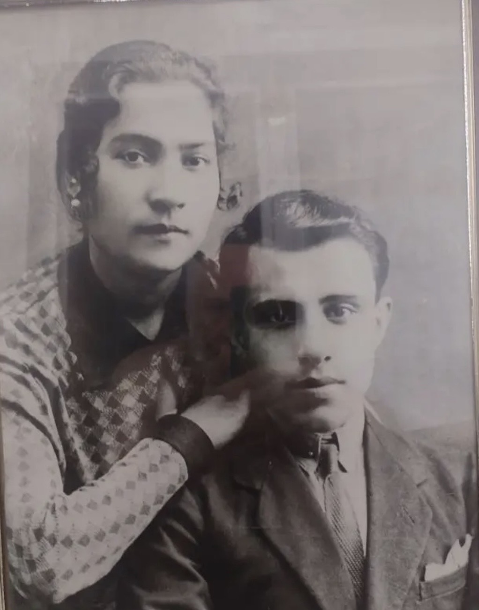
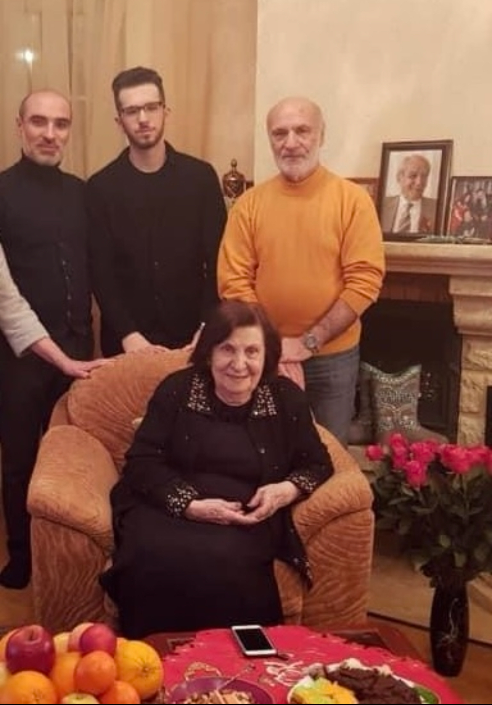
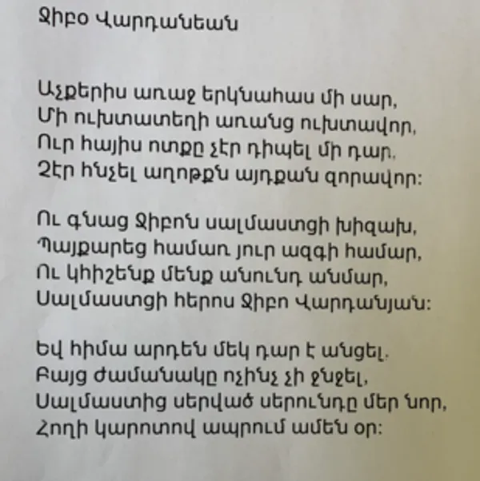
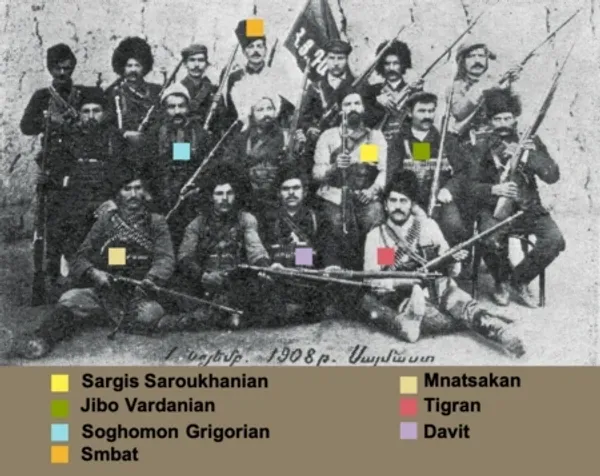
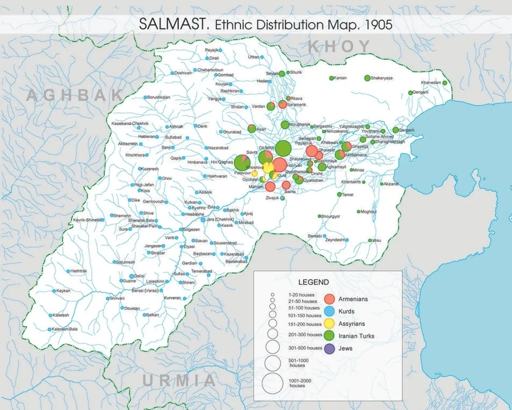
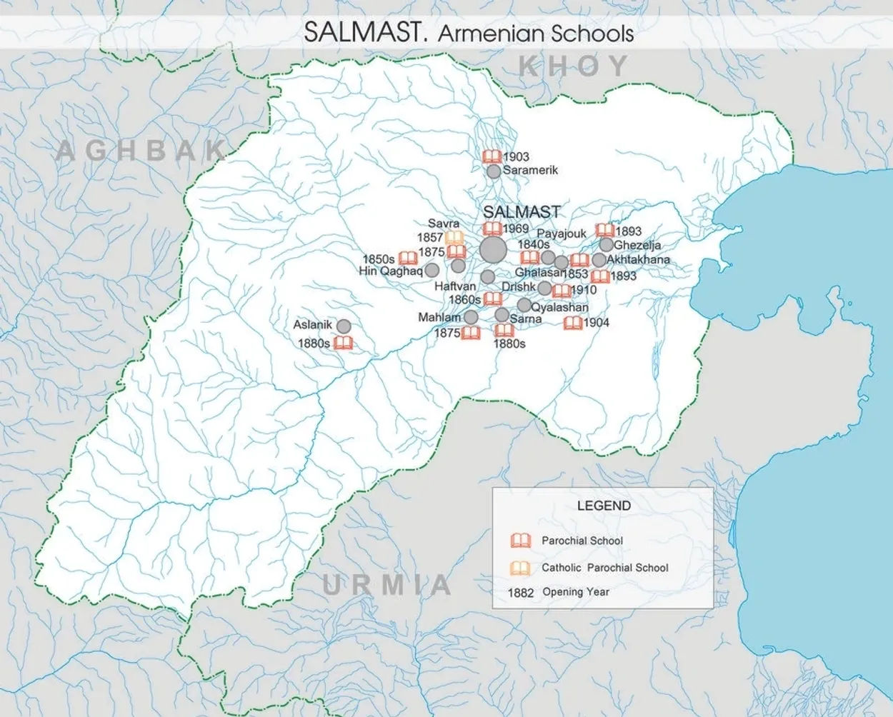
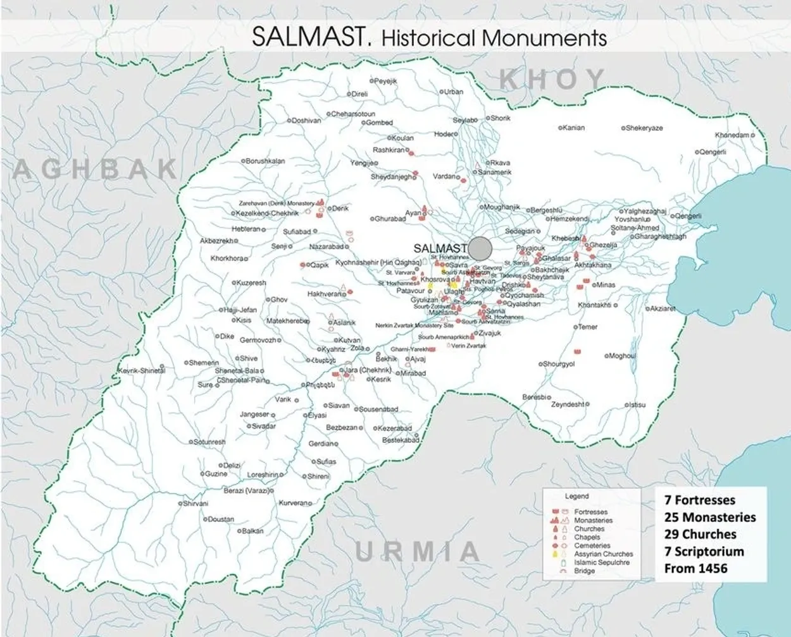

# 06 Фотографии

Здесь собраны визуальные материалы по родовому расследованию.

<figure>

<figcaption>Мелик и Арпеник, 1930-е</figcaption>
</figure>

<figure>

<figcaption>Дом Вартанянов</figcaption>
</figure>

<figure>

<figcaption>Хачкар Джибо Варданяна</figcaption>
</figure>

<figure>

<figcaption>Могила Вардана Мамиконяна</figcaption>
</figure>

<figure>

<figcaption>Салмастские фидаины, 1908</figcaption>
</figure>

<figure>

<figcaption>Этническая карта Салмаста, 1905</figcaption>
</figure>

<figure>

<figcaption>Карта школ Салмаста</figcaption>
</figure>

<figure>

<figcaption>Карта памятников Салмаста</figcaption>
</figure>

<figure>

<figcaption>Выступление Пападжанова, стр. 1</figcaption>
</figure>

<figure>

<figcaption>Выступление Пападжанова, стр. 2</figcaption>
</figure>

<figure>

<figcaption>Выступление Пападжанова, стр. 3</figcaption>
</figure>

